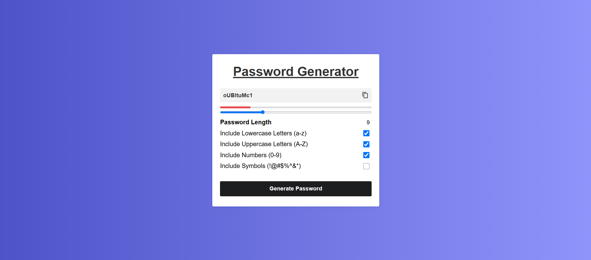

# Random Password Generator

## Description
This Random Password Generator tool allows users to generate secure, randomized passwords based on customizable criteria like length, lowercase letters, uppercase letters, numbers, and symbols.

## Features
- Customizable password length.
- Options to include lowercase letters, uppercase letters, numbers, and symbols.
- Real-time password strength indicator.
- Copy generated password to clipboard.

## How to Use
1. Open the project in your browser.
2. Use the slider to select the desired password length.
3. Select or deselect the options for lowercase, uppercase, numbers, and symbols.
4. Click the "Generate" button to create a password.
5. Use the "Copy" button to copy the generated password to your clipboard.

## Screenshot

## How It Works
1. **Input Slider**: Adjust the slider to set the desired password length.
2. **Checkboxes**: Toggle the checkboxes to include/exclude lowercase letters, uppercase letters, numbers, and symbols.
3. **Generate Button**: Click to generate a password based on selected criteria.
4. **Copy Button**: After generating the password, use the copy button to copy it to the clipboard.
5. **Password Strength Indicator**: Displays the strength of the password (weak, medium, strong) based on its length and character composition.

## Future Enhancements
- Adding additional customization options for character types.
- Implementing a dark mode/theme for the generator.
- Adding support for exporting generated passwords as files.

---
Contributions are welcome! If you'd like to contribute to this project, please fork the repository and create a pull request.

